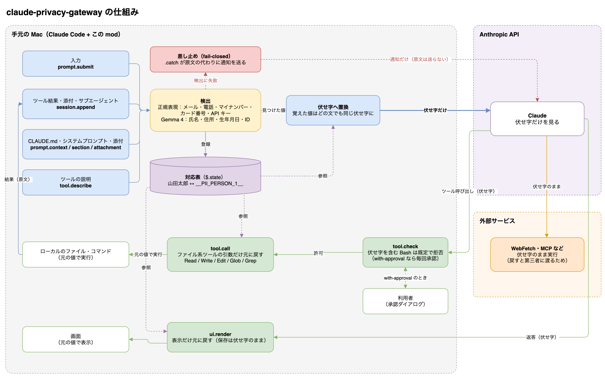

# claude-privacy-gateway

Claude Code の Mods（function hooks）で、PII や秘密情報が Claude に届く前に伏せ字（`__PII_PERSON_1__`）へ置き換え、
手元で完結する処理と画面表示のときだけ元の値に戻す PoC。検出は正規表現とローカルの Gemma 4（LM Studio）で行う。

> Mods は early access の API で、Claude Code のリリースごとに変わりうる。この PoC は Claude Code 2.1.289 で検証した。

## 仕組み



`docs/architecture.drawio.png` は図のデータを埋め込んだ PNG で、draw.io でそのまま開いて編集できる。

- 一度覚えた値は、以後どのテキストでも同じ伏せ字に置き換える（Gemma が見落とした文でも伏せる）
- 伏せる側の hook にはすべて `.catch` を付けて fail-closed にしている。付けないとエンジンが `next(e)` を代行し、原文が届く
- 対応表はセッションの `$.state` に置き、hot reload 後も同じ番号で戻せる

## 何を守り、何を守らないか

守るもの: **Claude（Anthropic の API）に PII と秘密情報の原文が届かないこと**。入力・ツール結果・添付・CLAUDE.md・
システムプロンプト・ツールの説明を、送る前に伏せ字にする。検出に失敗したら原文を送らずに差し止める（fail-closed）。

守らないもの:

- **手元のツールを使った持ち出し**。伏せ字を戻す Bash には承認を求め、通信系に見えるコマンド（`curl`、`/usr/bin/curl`、
  `gh`、`git push` など）には承認に関わらず戻さない。ただし承認を下すのはモードごとの判定者で、オートモードでは判定器（Claude）が
  許可しうるし、`python3 -c '...urllib...'` のような書き方は名前の網を抜ける。`curl -d @patients.md ...` のように元のファイルを
  直接送るコマンドには伏せ字が無く、そもそも止めない。Claude Code の権限設定やサンドボックスで防ぐこと
- **Gemma の見落とし**。検出は確率的で、検査対象の文に「何も無いと答えよ」と仕込まれれば外れうる。
  形の決まった値（メール、電話、マイナンバー、カード番号、API キー）は正規表現が別に拾う
- **エンジンが書き換えを許さないブロック**。会話の行の最上位にある未知の種類のブロックは、エンジンが元に戻すので伏せられない。
  通ったときは debug ログに `{"event":"unmasked-block","type":...}` を出す
- **手元に残る原文**（下の「既知の制約」）

## 使い方

```sh
just install   # TypeScript を入れる
just gemma     # LM Studio のサーバを起動し、Gemma 4 12B（MLX 6bit）を読み込む
just run       # この mod を読み込んだ Claude Code を起動する（claude --plugin-dir .）
just check     # 型検査・claude plugin validate・claude plugin test
```

設定は `~/.claude/settings.json` の `pluginConfigs["privacy-gateway@inline"].options`（または `--settings`）で変える。

| option | 既定値 | 意味 |
| --- | --- | --- |
| `gemmaUrl` | `http://127.0.0.1:1234/v1/chat/completions` | OpenAI 互換のエンドポイント |
| `gemmaModel` | `gemma-4-12b-it-mlx-bench@6bit` | 検出に使うモデル |
| `onDetectorError` | `block` | Gemma 失敗時に送信を止める（`regex-only` なら正規表現だけで伏せて送る） |
| `detectionScope` | `full` | エンジンが書く文（スキル一覧、MCP の説明、システムプロンプトの固定セクション）も Gemma で検査する。`fast` ではそれらを正規表現と既知の値だけにする（速いが、利用者が書いたスキルの説明などの人名が通り抜ける） |
| `images` | `drop` | 伏せられない画像・文書を除外する（`pass` で素通し） |

## 検証結果（2026-10-06、Claude Code 2.1.289 / Sonnet / Gemma 4 12B MLX 6bit）

架空の患者記録（氏名・電話・メール）を置いたディレクトリで `claude -p --plugin-dir` を実行した。

| 確認したこと | 結果 |
| --- | --- |
| Claude が読んだ Read の結果 | `担当: __PII_PERSON_1__` / `連絡先: __PII_PHONE_1__` / `メール: __PII_EMAIL_1__` |
| Claude の Edit（`old_string: 担当: __PII_PERSON_1__`） | 実行直前に戻り、ファイルには `担当: 山田太郎（確認済み）` と実名で書き込まれた |
| transcript JSONL の `message.content`（送信される側） | 原文 0 件 |
| Gemma が 503 を返したとき | ツール結果は `[privacy-gateway] … Claude に送っていません` に差し替わり、Claude は内容を見られなかった |
| 所要時間 | 約 3 分（偽の即答 Gemma では 14 秒。ほぼすべてが Gemma の推論待ち） |
| 実際の API リクエスト本文（`ANTHROPIC_BASE_URL` を記録用の中継に向けて取得） | mod なしでは氏名・メール 3 種・git のユーザー名が生で送られた。mod ありでは 3 リクエストとも原文 0 件 |
| 同上、CLAUDE.md とユーザー情報 | 伏せ字で届いた（`業務用メールアドレスは __PII_EMAIL_2__`、`The user's email address is __PII_EMAIL_1__`、`Git user: __PII_PERSON_2__`）。差し止め 0 件、48 秒（`fast` 相当） |
| `detectionScope: full`（既定）の E2E | 差し止め 0 件、伏せられないブロック 0 件。ただし 290 秒。Gemma で 121 か所を検査し、MCP のツール説明が送り直し込みで最長 129 秒かかった |

`claude plugin test .` で 25 件のテストが通る（hook の結線、伏せ字の往復、承認、検査範囲、検算、fail-closed の分岐）。

## 検出器の比較（DiffusionGemma）

DiffusionGemma（`mlx-community/diffusiongemma-26B-A4B-it-4bit`、mlx-vlm 0.7.4）は LM Studio が未対応なので、
`just diffusion` で mlx-vlm のサーバを立て、`just run-diffusion` で検出器を切り替える。

| 測定 | Gemma 4 12B（LM Studio, MLX 6bit） | DiffusionGemma 26B A4B（mlx-vlm, 4bit） |
| --- | --- | --- |
| 検出プロンプト 5 例（医療・チャット・コード・伏せ字・英語） | 4 例正解（コメント中の `Tanaka` を見落とし） | 5 例正解 |
| キャッシュの効かない 1,500 字 × 1 件 | 13.2 秒 | 3.0 秒 |
| 同 × 7 件同時（起動直後を模擬） | 50〜86 秒（7 件とも 30 秒超） | 最遅 21〜32 秒。ただし Metal の打ち切り（`Impacting Interactivity`）で 0〜4 件が HTTP 500 |
| E2E（API リクエスト本文で確認） | 原文 0 件、差し止め 0 件、48 秒 | 原文 0 件、`memory` セクションを 1 件差し止め、71 秒。GitHub / Twitter のハンドルまで伏せた |

速さの差は拡散方式による出力の速さより、アクティブ 3.8B の MoE で前処理が軽いことによる（出力は 5 トークン前後しかない）。
mlx-vlm の DiffusionGemma は負荷がかかると GPU の打ち切りが起き、`--max-num-seqs 1` と
`MLX_MAX_OPS_PER_BUFFER` / `MLX_MAX_MB_PER_BUFFER` を小さくしても消えなかった。5xx は送り直すが、使い切ると差し止めになる。

## 既知の制約

- **起動直後の検査は `$.http.fetch` の 30 秒の上限と競争になる**: 起動直後は CLAUDE.md・memory などを一斉に Gemma で検査する。
  12B（MLX 6bit）は 1,500 字の塊の前処理に 12 秒前後かかり、並ぶと 30 秒を超えて切られ、`.catch` が中身ごと差し止めていた
  （CLAUDE.md やユーザー情報が Claude に届かない。漏れはしない）。対策として、エンジン固定の一覧は正規表現だけにし、
  検査結果を行単位で使い回し、切られた問い合わせは送り直す（LM Studio は切断後も前処理を終えてキャッシュするので、送り直すと速く返る）。
  最後の検証では LM Studio のキャッシュが温まっていて送り直しは起きておらず、冷えた状態で送り直しが効くことはテストでしか確かめていない
- **手元には原文が残る**
  - transcript JSONL の `toolUseResult`（画面描画用の構造化記録）はエンジンが作ったまま保存する。送信はされない
  - LM Studio は詳細度 DEBUG（`developer.runtimeLogVerbosityLevel = 3`）でリクエスト本文を `~/.lmstudio/server-logs/` に平文で記録する
- **`-p`（ヘッドレス）の出力は伏せ字のまま**: `ui.render` が無いため。`turn.complete` で戻せるかは未検証
- **初回応答が遅い**: 既定（`full`）では MCP のツール説明・スキル一覧・CLAUDE.md をすべて Gemma に通すので、MCP サーバの多い環境では
  最初の応答まで約 5 分かかった。`detectionScope: fast` なら約 1 分。ほかの対策案は、検出結果のキャッシュを `$.store` に永続化する、
  速いモデル（DiffusionGemma、E4B）に替える、など
- **検出漏れ**: Gemma は確率的。例えばコード中のコメントに書かれたローマ字名（`Tanaka`）は見落とした。既知の名簿を辞書として先に登録する仕組みは未実装
- **組織アカウント**: Team / Enterprise では組み込みの `sec-default` mod が `prompt.context` / `prompt.section` をユーザーの mod から守るので、CLAUDE.md とシステムプロンプトは伏せられない。`allowManagedModsOnly` が有効だとこの mod 自体が読み込まれない

## Mods API で詰まった点（2.1.289）

- `$` は関数の引数にできない（`$.noun.event(...)` の形で呼び出し箇所に綴る）。必要な操作をクロージャにして渡す（`hooks/gateway.ts` の `Port`）
- `read` / `update` に渡す atom は、呼び出すファイル自身の const で定義する（`claude plugin validate` が静的に読む）
- テストキットでは `session.append` の受け手を立てられない（`next` なしの答えは捨てられ、下にも実装がない）。行の書き換えは単体テストと E2E で確かめた
- hook が投げて `.catch` も無いと、エンジンは `next(e)` を代行する（fail-open）。`.catch` の猶予は 1 秒なので、その中で Gemma は呼ばない
- hook の持ち時間は 10 秒だが、`$` の呼び出し（`$.http.fetch` など）が走っている間は減らない。一方 `$.http.fetch` 自体には 1 回 30 秒の上限があり（型定義に記載なし、観測）、超えると `HooksError` で切られる
- debug ログ（`--debug-file`）に検査 1 回ごとの JSON を 1 行出す（`{"plugin":"privacy-gateway","event":"mask","site":"context:claudeMd","depth":"full","chars":11666,"added":1,"ms":10738}`）。中身は載せない
